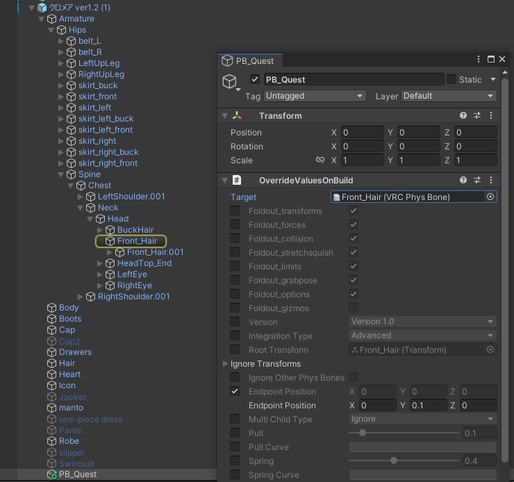
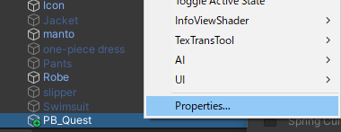
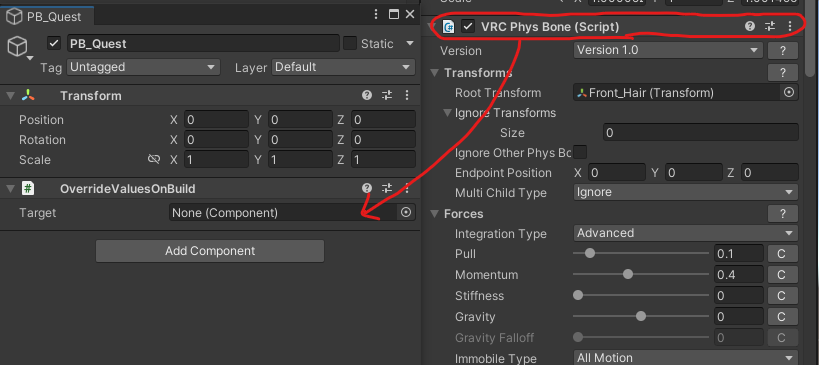

# Override Values on Build

NDMFビルド時にコンポーネントの値を書き換えるOverrideValuesOnBuildコンポーネント

OverrideValuesOnBuildコンポーネントはActiveな場合にのみ上書きを実行します。

## Install

### VCC用インストーラーunitypackageによる方法（おすすめ）

https://github.com/Narazaka/override-values-on-build/releases/latest から `net.narazaka.vrchat.override-values-on-build-installer.zip` をダウンロードして解凍し、対象のプロジェクトにインポートする。

### VCCによる方法

1. https://vpm.narazaka.net/ から「Add to VCC」ボタンを押してリポジトリをVCCにインストールします。
2. VCCでSettings→Packages→Installed Repositoriesの一覧中で「Narazaka VPM Listing」にチェックが付いていることを確認します。
3. アバタープロジェクトの「Manage Project」から「Oveerride Values on Build」をインストールします。

## 使い方

アバター内の任意のオブジェクトに「Add Component」ボタンから「OverrideValuesOnBuild」コンポーネントを付けます。

Targetの欄に値を上書きしたいコンポーネントを指定し、設定します。

### コンポーネントを選ぶには？

コンポーネントを個別に設定するには、コンポーネントのヘッダ部分をドラッグ&ドロップする必要があります。

OverrideValuesOnBuildが付いているGameObjectをヒエラルキー上で右クリックして、一番下にある「Properties...」というメニューを選ぶとそのオブジェクトがポップアップ表示になります。

このポップアップしたOverrideValuesOnBuildに、対象のコンポーネントのヘッダ部分をドラッグ&ドロップする方法が便利です。

## 更新履歴

- 0.1.1: BeforePlugin指定で互換性向上
- 0.1.0: リリース

## License

[Zlib License](LICENSE.txt)
